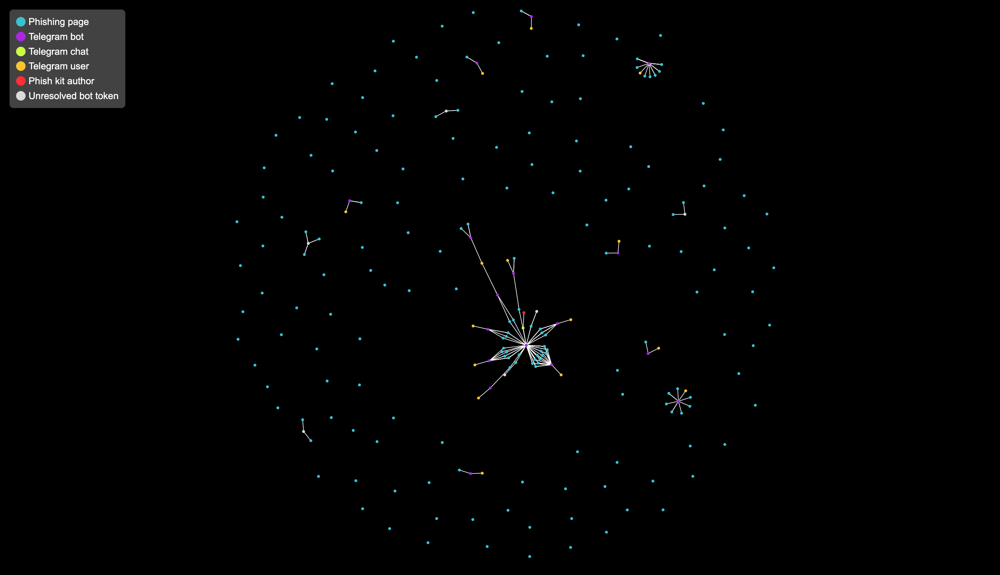

# Phishing Attribution Graph

A simple, interactive graph built using React that visualizes the relationship between phishing sites and associated Telegram users.

Individual nodes can be selected to view additional details including profile photos, names, usernames, screenshots, and phishing URLs.

See a live [demo](https://bails.dev/graph/) of the graph in action, or read the [technical write-up](https://bails.dev/posts/fi-phishing-attribution/) to see how this data was obtained.



## Getting Started

### Development

Update `public/data.json` with the desired graph data and remove the sample profile photos (`public/photos/`). Start the develpment server.

```sh
npm run dev
```

### Deploying

When building for production, the base URL must be specified if it will not be hosted at `/`. Replace `data.json` and `photos/` with the appropriate data.

```sh
npm run build -- --base="/graph/"
```
